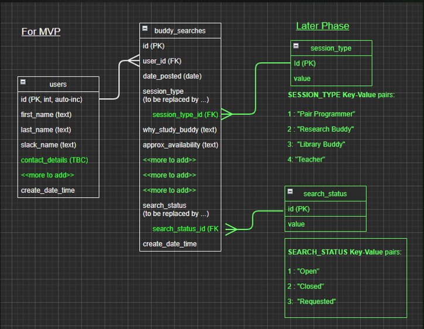

# SERVER REPO (Node.js -Express - REST API - PostgreSQL DB - Deployed on Heroku)

Where we are often now frequently studying remotely, we might still wish to study with someone else, either to share a research task, to try implementing a new technology, to do some pair programming on a joint code base, or maybe to study silently, but with other silent partners also present on a zoom call. The front end application (see separate repo), allows you to browse existing requests for a remote study partner, while also letting you add your own study partner request

This repo contains a 'proof of concept' server for the back end of a 'study buddy' app. It is written without using express-generator. It currently contains the scripts to set up and populate basic user and 'study request' table
(The data model shows the tables for the MVP in green and tables for upcoming functionality, in white<br><br>


<br>The RESTful API currently contains basic routes to get all the study buddy requests, and to post a new request.

This readme file contains the setup steps i followed from start to finish to get this server up and working with a couple of database tables, and a simple route.

# PACKAGE INSTALLATIONS + package.json file edits

-   DONE - clone the second repo from github down into a local folder, e.g.

    ```
    /study-buddy-project/server/
    ```

-   DONE - initalise folder as git one (already done by cloning down repo)

-   DONE - go into that folder and, at the command prompt, initialise as an "npm" folder npm one, creating package.json

    ```
    $ cd server
    $ npm init
    (for anyone cloning:  you will (probably?) need to re-do this)

        package name: study-buddy
        version : <<i left this as default, 1.0.0>>
        description : gets all study buddy requests and posts new
        entry point: <<i left this as default, index.js >>
        test command:
        git repository : <<i left this as default >>
        keywords:
        author: George Rosanna Charlotte Sinead
        licence:
    ```

-   DONE - install dependencies - express , pg for prod, nodemon, dotenv just for dev (-D or --save-dev)

    ```
    DONE - $ npm i express        [Fast, unopinionated, minimalist web framework for node.]

    DONE - $ npm i pg             [on-blocking PostgreSQL client for Node.js.]

    DONE - $ npm i -D nodemon     [helps develop node.js based applications by automatically restarting the node application when file changes in the directory are detected]

    DONE - $ npm i -D dotenv      [loads environment variables from a .env file into process.env variable]

    DONE - $ npm install env-var  [will alert you immediately if your environment is misconfigured e.g. some required database-related environment variable]


    DONE - $ npm install cors  [added this LATER to try and fix CORS error when our client tries to get data from API]

    (for anyone cloning: just run $npm i, since the dependencies will be in the package.json)
    ```

_Note: The additional packages that are installed in the School of Code example include cookie-parser, debug and morgan and, in devDependencies, jest and supertest._

---

    TODO: (if we want) to cover CORS issues, install cors:
    ```
        $ npm install cors
    ```
    and then later in the code ,, add a route, app.use(cors);
    END OF TODO:

---

-   DONE - Edit package.json (the dependencies should have now been added) _[NB - DO package.json edits AFTER ALL THE INSTALLS otherwise express install will fail]_

    -   DONE - add type/module line
        ```
            "type" : "module",
        ```
    -   DONE - set up the script shortcuts _(remember to include "-r dotenv/config " for anything using db connection)_

        ```
        "start": "node -r dotenv/config  ./bin/www.js",

        "dbcreatestudyrequeststable": "node -r dotenv/config ./db/scripts/createStudyRequestsTable.js",

        "dbpopulatestudyrequeststable": "node -r dotenv/config ./db/scripts/populateStudyRequestsTable.js",

        "dev" : "nodemon -r dotenv/config  ./bin/www.js",

        "test": "echo \"Error: no test specified\" && exit 1"

        ```

        Note: previously we used to set "start" to use app.js, not bin/www.js. That was because in the earlier lectures, we had the app.listen() code in app.js along with the router code all in one file. Now we've progressed, and we've separated the app.listen code out into the www.js file

---

# PROJECT FOLDER + FILE STRUCTURE SETUP

DONE - create folders, and EMPTY files:

```
    DONE - server/

    DONE - server/.env

    DONE - server/.env.example

    DONE - server/.gitignore


    DONE - server/app.js      (NB: NOT auto-created)

    (server/config.js NOT NEEDED, we think - see below for why)


    DONE - server/bin/        (NB: NOT auto-created)

    DONE - server/bin/www.js  (NB: NOT auto-created)


    DONE - server/db/

    DONE - server/db/index.js   - [with the pool setup (and importing pg), and using the env variables via the db constants from config,js]


    DONE - server/db/scripts


    DONE - server/db/scripts/dropBuddySearchTable.js
    DONE - server/db/scripts/createBuddySearchTable.js
    DONE - server/db/scripts/populateBuddySearchTable.js
    *(Note: there will be a set of these for each table we need to set up)*

    DONE - server/models/

    DONE - server/models/buddysearches.js    [for the SQL for 'getAllBuddySearches']


    DONE - server/routes/
           server/routes/buddysearches.js   [for the ROUTER for getAllBuddySearches, postBuddySearch etc]

```

---

# FILE CONFIG (the rest of it)

## app.js config

Set up express, and the routes. Type the following into your app.js file:

```
    import express from "express";
    const app = express();

    app.use(express.json());
    export default app;
    // FYI the database PORT is now covered in bin/www.js

    //TODO: will add the routes into here?

```

---

## bin/www.js config

Set up the database PORT and the listener. Type the following into your app.js file:

```
    import app from "../app.js";

    const PORT = process.env.PORT || 5000;
    // i.e. if there's a port for heroku, use that, otherwise go for local host

    app.listen(PORT, () => {
        console.log(`listening on PORT ${PORT}`);
    });

```

---

## db/index.js config

Set up the PostgreSQL connection object. Type the following into your app.js file:

```
    import pg from "pg";
    const pool = new pg.Pool({
        //set up connection string object
        connectionString : process.env.DATABASE_URL,
        max: 20,
        idleTimeoutMillis: 30000,
        connectionTimeoutMillis: 2000,
        ssl: {
            rejectUnauthorized: false
        }
    });

    export default function query(text, params) {
        return pool.query(text, params);
    }

    Note the DATABASE_URL has been taken from Heroku, and pasted into
    the .env file, and the dotenv package copies them from there
    into the process.env variable
```

---

# DATABASE - PART 1 SETUP

## Database creation - Heroku

-   DONE - on heroku.com, log in, set up a new database, and take a copy of the DATABASE*URL value for it *(for anyone cloning: you will need to do this also, and then paste the credentials into .env - see later)\_

    ```
    -> CLICK "new" button
    -> SELECT "Create New App"
    -> ENTER an app name:
            study-buddy-gcps
    -> CLICK "Create App" button
    -> CLICK "Resources" menu item
    -> CLICK Add-Ons
    -> SELECT "Heroku PostgreSQL" from the dropdown

    <you'll get a pop-up asking about what tier you want to use>
    -> select "Hobby Dev - Free"
    -> CLICK Submit
    -> CLICK on "Settings"
    -> CLICK on "Reveal Config"

    Then select the value for DATABASE_URL and copy it (you will be pasting it into the .env file)
    ```

---

## Environment Variables (for database connection)

Set up environment variables for the scripts to use to connect to the database _(Note: we did it with six different vriables in December. NOW, you can just use one)_

-   DONE - edit .env file - add following environment variable

    ```
        DATABASE_URL="paste in connection string from heroku website"
    ```

-   DONE - edit .env.example file - add following environment variable

    ```
        DATABASE_URL=
    ```

## Database config.js Script - TODO: NOT NEEDED?

Previously we needed a config.js file. It seemed to be used for two things:

-   assigning all the process.end.ENV_VARIABLES to a shroter onstant, like dbUser, dbHost etc (or to an object) - this is no longer as importnat since we now only need one environment variable to conect to Heroku, DATABAE_URL.

-   It also contained four lines commented _"Don't change anything in this file! This helps serve the front end."_. However we are now deploying the front and back end as different repos, not as a single full stack application, so this is currently not required either.

---

# TEST THE SET UP

---

So now we should try and start the server and make sure it's listening.

In the terminal, change to the /server/ folder and try to start

```
    $ cd server/
    $ npm start
```

Note: We can do further tests as we create the database files (see DATABASE - PART 2 - CODE) - for example, we can confirm that the application is talking to the postgre database on heroku and able to send and execute sql statements

---

# DATABASE - PART 2 - CODE

## Database Batch Scripts (run once for setup)

WRITE the db scripts to

-   DONE - DROP IF EXISTS the buddy_requests table (server/db/scripts/dropBuddySearchesTable.js)

-   DONE - CREATE buddy_requests table script (server/db/scripts/createBuddySearchesTable.js)

-   TODO: FILL (with test data) buddy_requests table (server/db/scripts/populateBuddySearchesTable.js)

-   TODO: DROP IF EXISTS the users table (server/db/scripts/dropUsersTable)

-   TODO: CREATE users table script (server/db/scripts/createUsersTable)

-   TODO: FILL (with test data) users table (server/db/scripts/populateUsersTable.js)

and add shortcuts into the package.json to run these:

```
        "dbdropbuddysearchestable": "node -r dotenv/config ./db/scripts/dropBuddySearchesTable.js",
        "dbcreatebuddysearchestable": "node -r dotenv/config ./db/scripts/createBuddySearchesTable.js",
        "dbpopulatebuddysearchestable": "node -r dotenv/config ./db/scripts/populateBuddySearchesTable.js",

        "dbdropuserstable": "node -r dotenv/config ./db/scripts/dropUsersTable.js",
        "dbcreateuserstable": "node -r dotenv/config ./db/scripts/createUsersTable.js",
        "dbpopulateuserstable": "node -r dotenv/config ./db/scripts/populateUsersTable.js",

        "dbcreatetesttable": "node -r dotenv/config ./db/scripts/createTestTable.js",
        "dbdroptesttable": "node -r dotenv/config ./db/scripts/dropTestTable.js"
```

---

## Database CRUD Scripts (run regularily from the API)

---

# ROUTES + RESTful API

-   Add express into app.js
    ```
      import express from "express";
      const app = express();
      app.use(express.json());
      export default app;
    ```
-   set up a route to GET ALL the study requests
    ```
    localhost/3000/studyrequests
    ```
-   set up a route to POST one new study request (and to return the new ID)
    ```
    localhost/3000/ ?????  - [TODO: confirm the route for this]
    ```
